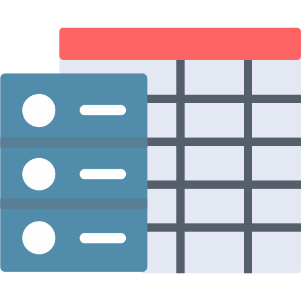

# Arquitetura e Estruturação do Frontend

Este documento registra decisões arquiteturais do projeto **Laboratório de Tabela Hash** e documenta possíveis caminhos de refatoração caso o sistema escale em complexidade e número de páginas.

## O Cenário Atual

Atualmente, o projeto é construído com base em **HTML estático puro** e **JavaScript Vanilla**, executado integralmente no lado do cliente (Client-Side). 

**Vantagens do modelo atual:**
- **Portabilidade:** O simulador pode ser executado em qualquer navegador moderno simplesmente com um clique duplo nos arquivos HTML (via protocolo `file://`), sem a necessidade de um servidor web ou instalação de dependências.
- **Simplicidade:** Não há processos de build (compilação), facilitando o entendimento por estudantes ou iniciantes na tecnologia web.

**Desvantagens do modelo atual:**
- **Repetição de Código (Boilerplate):** Como o HTML nativo não possui uma função de `include`, componentes estruturais presentes em todas as telas (como o rodapé e os menus de navegação) precisam ter seus códigos replicados em todos os arquivos `.html` (ex: `index.html`, `sobre.html`, `privacidade.html`, etc).

## Roadmap Técnico: Lidando com a Repetição de Código

Caso o projeto cresça e passe a demandar um número maior de páginas e atualizações frequentes nas seções globais, a repetição de código atual pode gerar sobrecarga de manutenção. Abaixo listamos três estratégias progressivas para solucionar este problema:

### 1. Injeção Dinâmica com JavaScript (Solução de Baixa Complexidade)
A maneira mais simples de resolver a repetição de código sem perder a característica "Zero Dependências" do projeto é isolar a estrutura comum num script JavaScript.

**Como funciona:**
Criamos um arquivo genérico (ex: `components.js`) que contém a estrutura HTML do rodapé como uma *String* (Template Literal). O script é responsável por injetar essa estrutura no final do corpo da página assim que ela for carregada.

**Exemplo de Implementação:**
```javascript
// components.js
document.addEventListener("DOMContentLoaded", function() {
    const footerHTML = `
    <footer>
        <div class="footer-left">
            
            <!-- Links etc... -->
        </div>
    </footer>
    `;
    
    document.body.insertAdjacentHTML('beforeend', footerHTML);
});
```

**Uso nas páginas:**
Basta remover o HTML do rodapé e incluir a tag `<script src="components.js"></script>` em cada arquivo `.html`.

### 2. Web Components (Solução Intermediária / Moderna)
Os *Web Components* são um padrão do próprio HTML5/JavaScript para encapsular estruturas HTML customizadas e sua estilização (Shadow DOM).

**Como funciona:**
Criaríamos um componente customizado `<app-footer></app-footer>` que seria definido via JavaScript.
Essa técnica é nativa, elegante e evita que os estilos do rodapé entrem em conflito com as páginas, mas requer uma compreensão um pouco maior de classes em JavaScript.

### 3. Geradores de Site Estático ou Bundlers (Solução Avançada)
Se a aplicação se tornar um laboratório gigante com centenas de páginas ou integrar bibliotecas de UI, a injeção via JavaScript no tempo de execução deixará de ser a melhor prática de performance.

**Como funciona:**
Emprega-se um *Static Site Generator* (SSG) como **Astro**, **Eleventy (11ty)**, ou **Vite**. 
Nesse modelo, o desenvolvedor escreve o código com componentização em arquivos separados (ex: `Footer.astro`), e a ferramenta fica encarregada de "compilar" e "costurar" o projeto inteiro. O resultado será uma pasta `dist/` com arquivos HTML puros e idênticos aos de hoje (alta performance e SEO), mas cujo código-fonte gerador é totalmente modularizado. 

---

*Nota: Enquanto o escopo do projeto permanecer enxuto (em torno de ~10 arquivos HTML), a arquitetura base atual (com as repetições estruturais inerentes) é considerada aceitável e a mais prática para a distribuição offline.*
